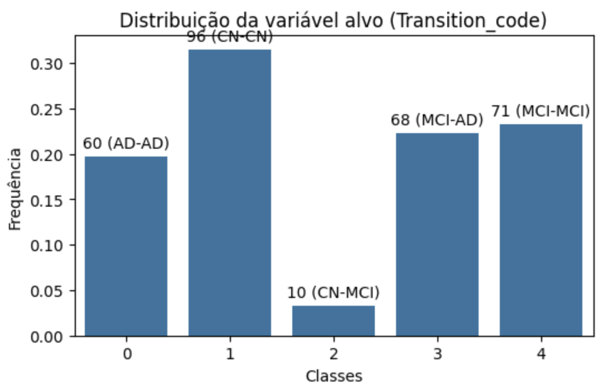
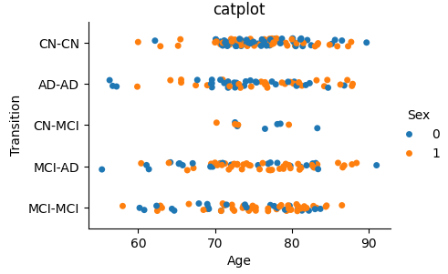
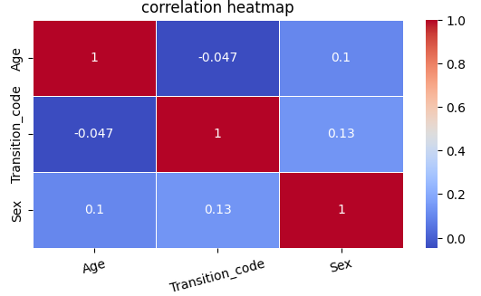

# DAA
DAA group pratical work

## Table of Contents

1. [Data Description](#data-description)
2. [Data Exploration](#data-exploration)
3. [Data Preprocessing](#data-preprocessing)
4. [Data Interpretability](#data-interpretability)
4. [Testing Phase](#testing-phase)
5. [FAQ](#perguntas-e-respostas)
6. [Useful Links / Refs](#useful-links--refs)

## Data Description
### Transition
- **CN**: Cognitive Normal, estado normal
- **MCI**: Mild Cognitive Impairment, estado entre o avanço normal da perda de memoria com a idade e um certo declinio serio de demencia
- **AD**: Azlheimer Disease, forma mais comum de demencia nas pessoas mais velhas

## Data Exploration
### Shape 
- **Rows**: 305
- **Columns**: 2181

### Columns
#### Age
- **Max**: 91
- **Min**: 55.3
- **Mean**: 75.1

#### Sex
- **Man**: 173 (57%)
- **Woman**: 132 (43%)

Relativamente Balanceado

#### Transition
- **CN-CN**: 96 (31.5%)
- **MCI-MCI**: 71 (23.3%)
- **MCI-AD**: 68 (22.3%)
- **AD-AD**: 60 (19.7%)
- **CN-MCI**: 10 (3.2%)

Muito desbalanceado, o que nos indica que é preciso ter cuidado com parâmetros e features.

Analisamos então a distribuição e correlação da idade e do sexo em relação à nossa coluna target:

### NaN Values
Não foram encontrados nenhuns NaN values nos datasets.

### Nunique Features
Encontramos algumas features constantes, no entanto decidimos não remover precipitadamente sem uma análise prévia, excluíndo no entanto apenas as features relacionadas com versões das tecnologias usadas.

### Non Numeric Features
Após a análise das features do tipo `object`, reparamos que existiam features capazes de ser transformadas em uma ou mais features numéricas, podendo trazer informação relevante para os futuros modelos.

No que toca a exploração de dados, foi feita uma análise mais profunda não mencionada por não trazer informação considerada relevante numa exploração global.

## Data Preprocessing
### Feature Target
No que toca a pré-processamento de dados, começamos por fazer `encoding` da nossa feature **target**, transformando-a numa feature numérica.

### Object Features
Seguidamente, como mencionado em [Data Exploration](#non-numeric-features), transformamos features do tipo `object` em várias features novas, servem de exemplo as seguintes transformações:

| diagnostics_Mask-original_BoundingBox | 
|-|
| (103, 113, 93, 36, 30, 71)| 
| (32, 104, 3, 54, 10, 89)| 

| x_min | y_min | largura | altura | profundidade | extra
|-|-|-|-|-|-|
|103|113|93|36|30|71 
|32|104|3|54|10|89 

As restantes features não numéricas foram removidas.

### Data Scaler
De modo a **padronizar** os dados, recorremos ao método `StandardScaler`. Desta forma, os valores das features são ajustados para uma escala comum, com média 0 e desvio padrão igual a 1, conseguindo **melhorar** assim o desempenho de modelos sensíveis à escala.

Por termos um **dataset limpo**, pouco pré-processamento de dados foi necessário, sendo portanto agora mais relevante uma análise das features.

## Data Interpretability
Para analisar a contribuição de cada feature para as previsões finais, recorremos à tecnologia **SHAP** capaz de nos ajudar a entender os outputs dos nossos modelos para cada classe.

Para concretização desta análise, recorremos ao modelo `XGBoost`, um modelo baseado em `DecisionTrees`. 

Por ser um modelo muito **eficiente**, **robusto**, altamente **eficaz** em encontrar **padrões** e **relações complexas** entre features e ainda lidar bem com **desbalanceamento de classes**, consideramos ser a escolha mais adequada para o problema. 

**A análise aos shap values ainda nao esta concluida, ainda nao pensei no que vamos falar sobre isto na apresentação.**

## Testing Phase
Para a fase de testes foram testados vários modelos, passando a numerar:
1. **LogisticRegression**: Um modelo muito básico que apesar de rápido, não nos traz resultados satisfatórios;
1. **RandomForest**: Um `ensemble` de `DecisionTrees` mais robusto, capaz de ajudar a evitar **overfitting**, lidando bem com dados não lineares.
1. **GradientBoost**: É também um `ensemble` de `DecisionTrees` que cria árvores sequencialmente, corrigindo os erros da anterior ao reduzir o `Loss`. No entanto é pouco eficiente.
1. **XGBoost**: É uma otimização do modelo anterior, sendo muito mais eficiente e tendo uma melhor performance devido à parelização, no entanto com a penalização de poder ter `overfitting` caso não seja bem **afinado**.
1. **LightGBM**:  Também é uma variação do `GradientBoost`, porém muito mais rápido e eficiente em datasets grandes, como é o nosso caso, priorizando features que maximizam os ganhos.
1. **CatBoost**: Mais uma variante do `GradientBoost`, mas não muito explorada devido ao seu alto custo computacional.
1. **SVM**: `Support Vector Machine ` já é um classificador baseado em margens, tendo portanto uma base diferente, obtendo boa performance e bom para lidar com dados não lineares.

Para a realização de `Ensemble` de modelos, decidimos explorar o `VotingEnsemble` e o `StackingEnsemble`, combinando os modelos `RandomForest`, `XGBoost`, `LightBoost` e `SVM` por obterem desempenhos individuais satisfatórios mas principalmente por se complementarem, ou seja, por cada um ter os seus **pontos forest** e as suas **fraquezas**.

Desta forma, conseguimos capturar **padrões** mais complicados com o **XGBoost** e o **LightBoost**, usar a robustez contra **overfitting** do **RandomForest** e a abordagem diferente do **SVM** que poderá capturar diferentes padrões que as árvores não captem. Assim, esta combinação permite aliar a robustez, eficiência e diversidade entre os modelos (árvores e SVM), tendo alto potêncial para **generalização** de novos dados.

Por termos apenas 4 modelos para aliar, concluímos que o `VotingEnsemble` não é a melhor opção, ao contrário do `StackingEnsemble` que utiliza um modelo de `LogisticRegression` para encontrar a melhor forma de combinar os 4 modelos.

No que toca a `tuning` de hiperparametros, utilizamos o método `RandomizedSearchCV`, aliado ao `RepeatedStratifiedKFold` (mencionado a seguir) de forma a encontrar hiperparametros mais adequados e precisos para cada modelo.

Para conseguir lidar com o desbalanceamento de classes e poder treinar e testar apenas com o dataset de treino e obter resultados mais fidedignos, recorremos ao método `RepeatedStratifiedKFold` em combinação com `cross_val_score`. Desta forma, somos capazes de fazer vários **cross validations** com diferentes `seeds` (diferentes conjuntos de dados), permitindo calcular **métricas** médias e **desvios padrão**, ajudando a avaliar a consistência e ainda garantimos uma **igual distribuição** de classes por cada um dos K folds.

## Perguntas e Respostas
### O que tem o problema ser desbalanceado?
Ser desbalanceado significa que a feature `target` apresenta muitas entradas para determinadas classes e poucas para outras. Basicamente, significa que vai poder treinar melhor para umas classes do que noutras, trazendo vários acertos nas classes que aparecem mais vezes e menos nas outras.

Isto é um problema muito importante porque torna necessária a análise mais profunda da importância de cada feature para cada classe individualmente.

Para já, para diminuir o impacto desse problema, estámos a recorrer apenas ao `StratifiedKFold`. O que isto faz? Bem basicamente, para treinar um dataset e não treinar sempre com os mesmos dados, é costume dividi-lo em `K` partes e treinar individualmente com cada uma delas, o que o `Stratified` nos traz de vantajoso é que cada uma dessas partes vai ter o mesmo número de entradas para cada classe, ou seja, se existem 10 entradas de cada classe e vamos dividir em `K=5`, então cada uma dessas 5 partes terá sempre 2 entradas para essa classe.

Para resolver este problema ainda é necessária a implementação de novas técnicas, como a análise do `ROC-AUC`, ajuste e cuidado com `BIAS` e com métricas `LOSS`.

### O que é o LOSS?
Em termos simples, é uma medida que quantifica a diferença entre as precisões feitas pelo modelo e os valores reais. O objetivo é sempre minimzar essa perda.

A chamada `Loss Function` é usada para quantificar o quão bem ou mal o modelo está a prever.

### O que é o BIAS?
Esta é complicada em termos matemáticos mas importante. 

Basicamente o **BIAS** é a incapacidade de um modelo se adaptar aos dados, ou seja, um modelo com **BIAS** alto é um modelo que não capturou bem os padrões, portanto, vai ter `underfitting`. Já um modelo com **BIAS** muito baixo, provavelmente vai encontrar os padrões extremamente bem no treino e depois não vai ser capaz de prever novos resultados bons, levando ao `overfitting`.

Assim, é preciso encontrar um **tradeoff** entre o **BIAS** e os scores dos modelos de modo a ter os resultados mais razoáveis (no sentido de bons para diversos casos) possível. O PROBLEMA AQUI É: EU NÃO SEI FAZER ISSO! ainda.

### O que são SHAP values?

### O que são dados não lineares?
Bem, por palavras minhas são dados que não apresentam uma forma linear simples com a coluna target, sendo portanto necessário modelos mais complexos para analisar essas relações e esses padrões.

## Useful Links / Refs
1. **Alzheimer**: [Data](http://adni.loni.usc.edu/)
2. **PyRadiomics**: [Documentation](https://pyradiomics.readthedocs.io/en/latest/features.html)
3. **IQR ouliers method**: [IQR](https://builtin.com/articles/1-5-iqr-rule)
4. **SHAP documentation**: [SHAP](https://shap.readthedocs.io/en/latest/)
5. **Hyperparameter Tuning**: [Tuning](https://www.geeksforgeeks.org/hyperparameter-tuning/)
6. **Bayesian Optimization**: [Bayes](https://www.geeksforgeeks.org/catboost-bayesian-optimization/)
7. **Different Boosting Methods**: [Boost](https://www.geeksforgeeks.org/gradientboosting-vs-adaboost-vs-xgboost-vs-catboost-vs-lightgbm/)
9. **Feature Engineering**: [FeatureEng](https://www.geeksforgeeks.org/what-is-feature-engineering/)
10. **Skewness & Kurtosis**: [SkewKurt](https://vivekrai1011.medium.com/skewness-and-kurtosis-in-machine-learning-c19f79e2d7a5)
11. **Going Deep with SHAP Values**: [Deep SHAP](https://medium.com/biased-algorithms/shap-values-for-multiclass-classification-2a1b93f69c63)
12. **Tudo e mais alguma coisa**: [ChatGPT](https://chatgpt.com)
13. **Tudo e mais alguma coisa 2**: [YouTube](https://www.youtube.com)